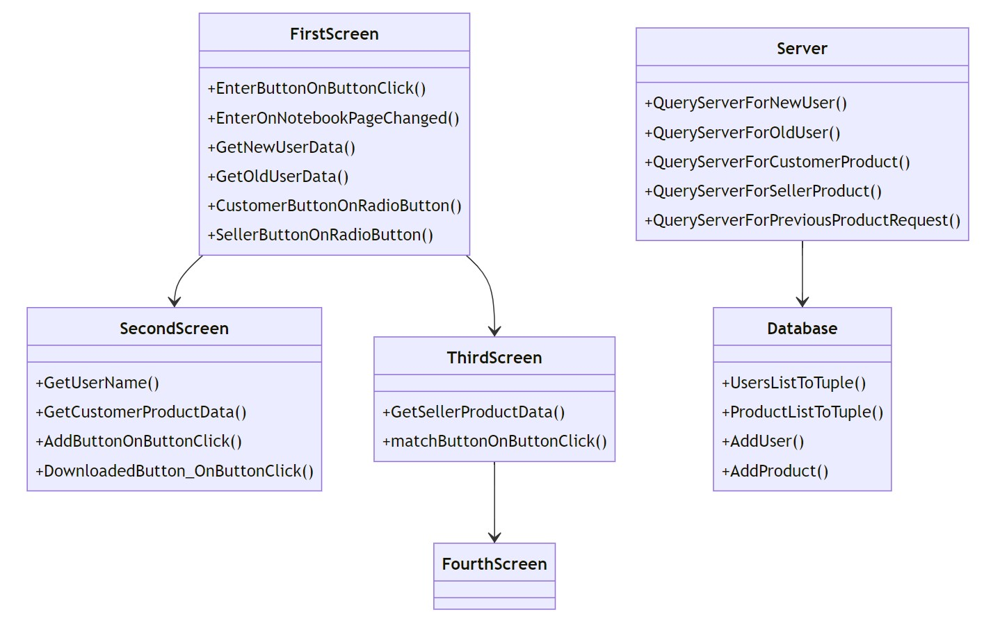

# Marketplace Chat App

This is a chat application that allows users to sign up as a customer or seller, add/view products, and match sellers to customers based on product requests.

## Overview

This is a chat application that allows users to sign up as a customer or seller, add/view products, and match sellers to customers based on product requests.

The main components are:

- **FirstScreen**: Handles new vs returning user login and directs to customer or seller flow. Gets input data and calls server APIs.

- **SecondScreen**: Customer screen to add/view products. Gets input data and calls server APIs. 

- **ThirdScreen**: Seller screen to enter product and find matches. Gets input data and calls server APIs.

- **FourthScreen**: Displays matches for the seller.

- **Server**: Contains API functions to communicate with backend server. Sends user data and receives responses.

- **Database**: Mock database to store user and product data. Used by server to get/update data.

The workflow starts with FirstScreen to handle login and determine user type. It calls Server APIs to authenticate and get user data.

For customers, it opens SecondScreen to allow adding/viewing products. It calls Server to send product data and receive info.

For sellers, it opens ThirdScreen to get product to match. It calls Server which checks Database and shows matches in FourthScreen.

This separation of concerns with GUI screens, centralized server logic, and mock database allows building up the chat flow and business logic modularly. The components work together to achieve the overall goal of matching buyers and sellers based on product interests.

Here are some conceptual differences that make this app unique compared to other typical market apps:

- **Buyer-driven matches**: This app has buyers enter product interests first, and then matches to sellers based on that. Most apps have sellers list items first instead.

- **Anonymity**: Buyers don't have public profiles and simply enter product interests. This allows more privacy compared to having a public shopping profile. 

- **Seller suggestions**: Sellers receive anonymous product suggestions to offer, rather than having to proactively list items to sell. This flips the traditional seller-driven model.

- **Two-sided onboarding**: The app onboards both buyers and sellers separately with tailored flows for each. Most apps focus on just buyer onboarding. 

- **Text-based preferences**: Buyers describe product interests through text rather than browsing catalogs. This allows more flexibility.

- **Two-way matching**: Once matched, buyers and sellers can contact each other directly for further discussions. Some apps lack this feedback loop.
